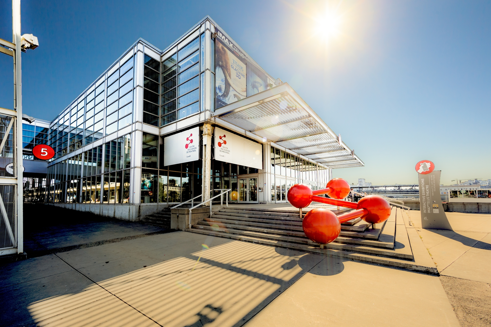
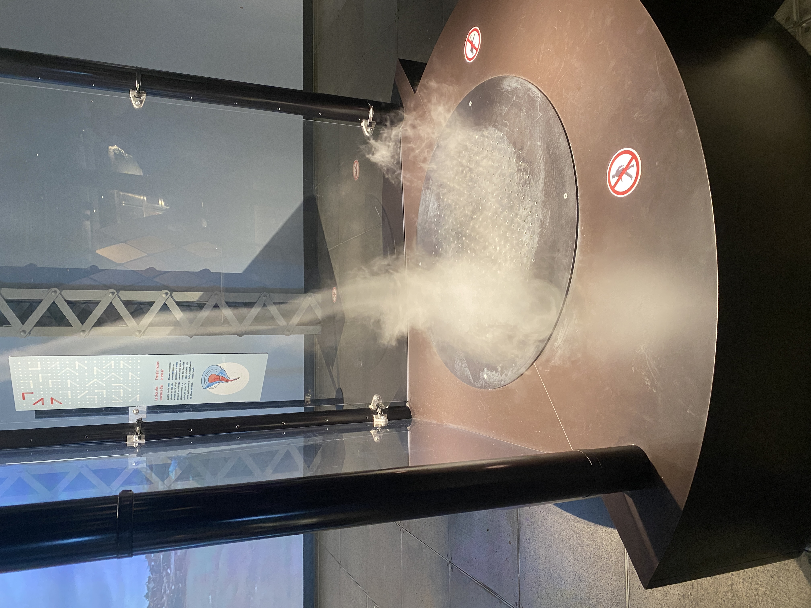
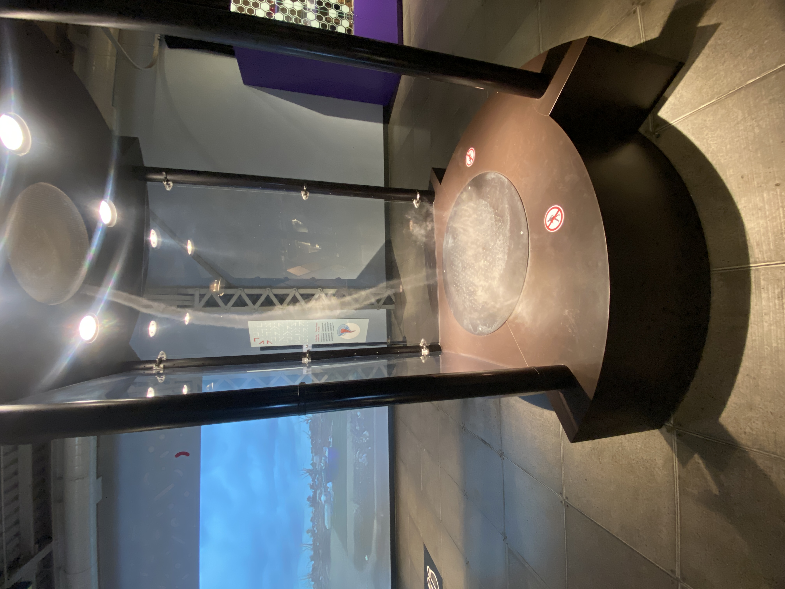
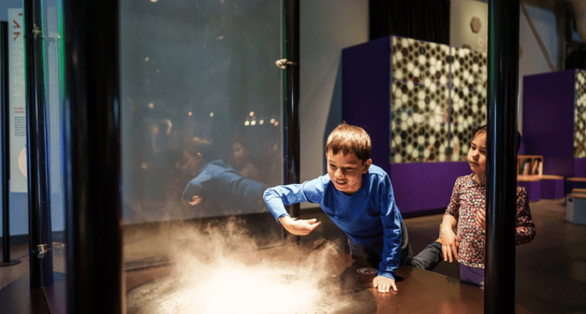

d# Fiche de l'œuvre : Simulateur de Tornade Miniature

## Informations générales

- **Nom de l'exposition :** Explore - La science en grand
- **Lieu de mise en exposition :** Centre des sciences de Montréal
- **Type d'exposition :** Intérieure
- **Date de votre visite :** 30 janvier

## Description du dispositif

* Le dispositif est une chambre cylindrique transparente équipée de ventilateurs disposés en cercle à la base pour créer un mouvement d’air rotatif. Un ventilateur vertical central pousse l’air vers le haut, formant un vortex visible grâce à un générateur de fumée ou un humidificateur. Des volets ajustables permettent de contrôler la taille et l’intensité de la tornade. Des lumières LED mettent en valeur les mouvements du tourbillon, et un panneau interactif permet aux visiteurs de modifier les paramètres en temps réel.

## Type d'installation

- **Catégorie :** Contemplative

## Mise en espace

## Composantes et techniques

* Pour simuler l'apparition d'une tornade tel que mis en exposition dans cette section de Explore, on crée une tornade de façon éxacte, mais de façon miniature. Une tornade se forme grâce à un mélange d'air chaud montant en rotation et d'un courant d'air descendant stabilisant le vortex. Pour simuler cela en miniature, on doit contrôler le mouvement de l'air et la visibilité du tourbillon avec de la vapeur ou de la fumée. Pour cela, on utilise ce qu'on va voir dans les éléments nécessaires à la mise en exposition.

## Éléments nécessaires à la mise en exposition

- 🔸 Des matériaux et composantes
Une chambre cylindrique ou en verre acrylique pour visualiser la tornade et une base solide avec des ventilateurs intégrés, tel que utilisé dans l'exposition.
- 🔸 Système d’air en rotation
Ventilateurs (au moins 2-4 petits ventilateurs placés de manière circulaire sur la base pour créer un mouvement de rotation)
Un ventilateur vertical sous la structure pour pousser l’air vers le haut
- 🔸 Générateur de "tornade" visible
Un humidificateur ou un générateur de fumée pour rendre l’air visible
Un système d’éclairage LED pour améliorer la visibilité de la tornade
- 🔸 Contrôle du flux d'air
Volets ajustables autour de la base pour contrôler l’intensité et la largeur de la tornade
Régulateurs de vitesse des ventilateurs pour ajuster le vortex

## Expérience vécue

Lors de ma visite, j'ai été immédiatement attiré par le "Simulateur de Tornade Miniature". En m'approchant, j'ai ressenti une légère brise, puis une colonne d'air en rotation est apparue devant moi, simulant une tornade en toute sécurité. Cette expérience immersive m'a permis de mieux comprendre les phénomènes météorologiques liés aux tornades.

## Ce qui vous a plu

J'ai particulièrement apprécié l'interactivité du dispositif et la manière dont il rend tangible un phénomène naturel aussi puissant. Cette expérience m'a inspiré à approfondir mes connaissances en météorologie et à envisager des projets éducatifs utilisant des simulations pour expliquer des concepts complexes.
